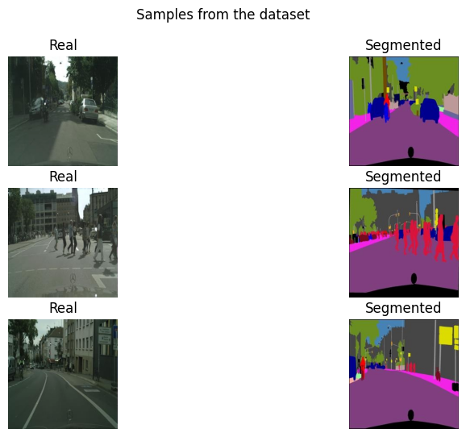
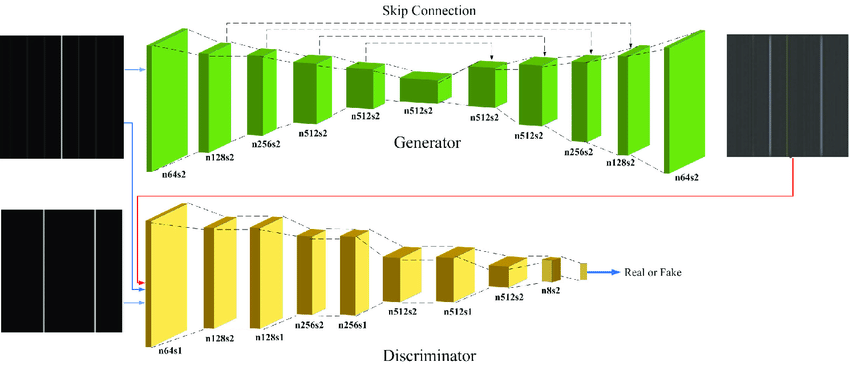

# CityGAN: Photorealistic Scene Generation from Semantic Maps

[](https://www.python.org/downloads/release/python-380/)
[](https://pytorch.org/)
[](https://jupyter.org/)
[](https://opensource.org/licenses/MIT)

> **Implementation of Pix2Pix Conditional GAN for semantic segmentation to realistic image translation using CityScapess dataset**

By **Harshil Pradhan**

---

## 📖 Introduction

This repository presents a comprehensive implementation of **CityGAN: Photorealistic Scene Generation from Semantic Maps**, a groundbreaking deep learning model for image-to-image translation tasks. Originally introduced by Isola et al. in their 2017 CVPR paper "Image-to-Image Translation with Conditional Adversarial Networks," Pix2Pix revolutionized the field of conditional image generation.

### What is Pix2Pix?

Pix2Pix is a **conditional Generative Adversarial Network (cGAN)** that learns a mapping from input images to output images. Unlike traditional GANs that generate images from random noise, Pix2Pix uses **input images as conditioning information** to produce corresponding output images, making it ideal for paired image-to-image translation tasks.

### Key Innovation

The revolutionary aspect of Pix2Pix lies in its ability to learn a **general-purpose loss function** for image-to-image translation problems, eliminating the need for task-specific, hand-crafted loss functions that were traditionally required for such applications.

### Applications

- **Semantic Segmentation to Photos**: Converting label maps to realistic architectural CityScapes
- **Architectural Visualization**: Transforming building sketches to photorealistic CityScapes  
- **Style Transfer**: Day-to-night translation, colorization tasks
- **Medical Imaging**: Cross-modal medical image translation
- **Map Generation**: Converting satellite imagery to street maps

---

## 📊 Dataset

### CityScapes Dataset Overview

This implementation utilizes the **CityScape dataset**, a comprehensive architectural dataset that provides paired images for building CityScapes generation:



#### Dataset Specifications
- **Training Images**: 400 high-quality architectural CityScapes pairs
- **Image Resolution**: 256×256 pixels 
- **Image Format**: RGB color images
- **Content**: Building CityScapess with corresponding semantic label maps
- **Geographic Coverage**: Various architectural styles and building types

#### Data Structure
```
├── Input (A): Semantic segmentation masks
│   ├── Colored label maps with architectural elements
│   └── Labels for windows, doors, walls, roofs, etc.
└── Target (B): Real photographic building CityScapes
    ├── High-resolution CityScapes photographs
    └── Corresponding ground truth for segmentation maps
```

#### Architectural Label Categories
- **Structural**: walls, roofs, foundations
- **Openings**: windows, doors, balconies  
- **Details**: decorative elements, textures, materials
- **Environment**: sky, vegetation, surrounding elements

### Training Configuration
- **Training Set**: 400 paired images
- **Batch Size**: 1 (optimal for Pix2Pix training)
- **Training Epochs**: 200  
- **Data Augmentation**: Random horizontal flipping (synchronized for input-output pairs)
- **Normalization**: Pixel values scaled to [-1, 1] range

---

## 🔬 Methodology

### Conditional GAN Framework

Pix2Pix employs a **conditional adversarial framework** where both generator and discriminator are conditioned on input images, creating a supervised image-to-image translation system.

#### Mathematical Formulation

The objective function combines adversarial and L1 losses:

```
G* = arg min max L_cGAN(G, D) + λL_L1(G)
      G   D
```

Where:
- **L_cGAN**: Conditional adversarial loss
- **L_L1**: L1 distance between generated and target images  
- **λ**: Regularization parameter (λ = 100)

#### Adversarial Loss
```
L_cGAN(G, D) = E_x,y[log D(x, y)] + E_x,z[log(1 - D(x, G(x, z)))]
```

#### L1 Reconstruction Loss
```
L_L1(G) = E_x,y,z[||y - G(x, z)||_1]
```

### Training Strategy

1. **Two-Player Minimax Game**: Generator tries to fool discriminator while discriminator learns to distinguish real from fake
2. **Conditional Training**: Both networks receive input image as conditioning information
3. **Balanced Optimization**: Generator and discriminator updated alternately to maintain equilibrium
4. **Mixed Objective**: Combines adversarial training with pixel-wise supervision

### Loss Function Analysis

The combination of adversarial and L1 losses provides:
- **Adversarial Loss**: Encourages realistic, sharp image generation
- **L1 Loss**: Ensures structural similarity to ground truth images
- **Balance**: λ = 100 provides optimal trade-off between realism and accuracy

---

## 🏗️ Generator Architecture

### U-Net Based Generator

The generator employs a **U-Net architecture** with skip connections, specifically designed for image-to-image translation tasks requiring detailed pixel-level correspondences.



#### Architecture Overview
```
Input (256×256×3) → Encoder → Bottleneck → Decoder → Output (256×256×3)
                      ↓           ↓           ↑
                  Skip Connections ────────────
```

#### Encoder (Downsampling Path)
- **8 Convolutional Blocks** with progressively increasing channels
- **Strided Convolutions** (stride=2) for spatial downsampling
- **Architecture Pattern**: `Convolution → BatchNorm → LeakyReLU`
- **Feature Map Progression**: 3 → 64 → 128 → 256 → 512 → 512 → 512 → 512 → 512

```python
# Encoder Architecture
C64 - C128 - C256 - C512 - C512 - C512 - C512 - C512
```

#### Bottleneck Layer
- **Spatial Dimension**: 1×1 (maximum compression)
- **Feature Channels**: 512
- **Purpose**: Captures global context and high-level semantic information

#### Decoder (Upsampling Path)  
- **8 Transposed Convolutional Blocks** for spatial upsampling
- **Concatenated Skip Connections** from corresponding encoder layers
- **Architecture Pattern**: `TransposedConv → BatchNorm → Dropout → ReLU`
- **Feature Map Progression**: 512 → 1024 → 1024 → 1024 → 1024 → 512 → 256 → 128 → 3

```python
# Decoder Architecture (with skip connections)
CD512 - CD1024 - CD1024 - C1024 - C1024 - C512 - C256 - C128
```

#### Skip Connections
- **Purpose**: Preserve fine-grained spatial information lost during downsampling
- **Implementation**: Channel-wise concatenation between encoder and decoder layers
- **Benefit**: Enables precise pixel-level correspondences for detailed image translation

#### Technical Specifications
- **Input Resolution**: 256×256×3 RGB images
- **Output Resolution**: 256×256×3 RGB images  
- **Total Parameters**: ~54M parameters
- **Activation Functions**: LeakyReLU (encoder), ReLU (decoder), Tanh (output)
- **Normalization**: Batch normalization throughout network

---

## 🎯 Discriminator Architecture

### PatchGAN Discriminator

The discriminator uses a **PatchGAN architecture** that classifies small patches of the image rather than the entire image, providing more detailed texture-level feedback.

#### Core Concept
Instead of outputting a single scalar value (real/fake), the PatchGAN produces a **30×30 feature map** where each element represents the authenticity of a corresponding patch in the input image.

#### Receptive Field Calculation
- **Output Feature Map**: 30×30×1
- **Receptive Field Size**: 70×70 pixels per output neuron
- **Coverage**: Each output neuron examines a 70×70 patch of the 256×256 input
- **Overlapping Patches**: Provides comprehensive image coverage through overlapping receptive fields

#### Network Architecture
```python
# PatchGAN Architecture
Input: Concatenated[Source Image, Target Image] (256×256×6)
↓
C64 - C128 - C256 - C512 - C512 - Conv1×1
↓  
Output: 30×30×1 (Patch Classifications)
```

#### Layer Specifications
1. **C64**: 4×4 Conv, stride=2, no BatchNorm → 128×128×64
2. **C128**: 4×4 Conv, stride=2, BatchNorm, LeakyReLU → 64×64×128  
3. **C256**: 4×4 Conv, stride=2, BatchNorm, LeakyReLU → 32×32×256
4. **C512**: 4×4 Conv, stride=1, BatchNorm, LeakyReLU → 31×31×512
5. **C512**: 4×4 Conv, stride=1, BatchNorm, LeakyReLU → 30×30×512
6. **Final**: 4×4 Conv, stride=1, Sigmoid → 30×30×1

#### Input Processing
- **Dual Input**: Discriminator receives both source image and target/generated image
- **Concatenation**: Images concatenated channel-wise (6 total channels)
- **Conditional Evaluation**: Determines if target image is a plausible translation of source

#### Advantages of PatchGAN
1. **Computational Efficiency**: Fewer parameters than full-image discriminator
2. **Local Texture Focus**: Emphasizes high-frequency details and textures  
3. **Scale Flexibility**: Can process images of varying sizes
4. **Faster Training**: Reduced computational complexity enables faster convergence

#### Training Details
- **Loss Function**: Binary Cross-Entropy loss
- **Optimization**: Adam optimizer (lr=0.0002, β₁=0.5)
- **Label Smoothing**: Real labels = 0.9, Fake labels = 0.1 (improves training stability)
- **Update Frequency**: Discriminator updated once per generator update

---

## 🚀 Getting Started

### Repository Structure
```
pix2pix-CityScapess/
├── pix2pix_conditional_gan_CityScapess.ipynb     # Main implementation notebook
├── README.md                                # This documentation  
├── requirements.txt                         # Python dependencies
└── assets/
    ├── sample_dataset_image.png
    ├── final_generated_image.png
    ├── epoch_loss.png
    ├── Pix2Pix-GAN-architecture.png
    └── CityScapess_generate_animation.gif
```

### Installation
```bash
git clone https://github.com/harshilpradhan/pix2pix-CityScapess.git
cd pix2pix-CityScapess
pip install -r requirements.txt
```

### Usage
1. Open the Jupyter notebook: `pix2pix_conditional_gan_CityScapess.ipynb`
2. The notebook contains complete implementation with:
   - Dataset loading and preprocessing
   - Model architecture definitions
   - Training loop with loss tracking
   - Visualization utilities  
   - Model saving and loading functions

---

## 📈 Results

### Training Progression Animation


*Training animation showing model improvement from epoch 1 to 200*

### Loss Curves


*Training loss curves showing generator and discriminator loss progression*

### Training Metrics
- **Training Duration**: 200 epochs
- **Convergence**: Stable loss convergence achieved around epoch 150
- **Generator Loss**: Stabilized around 1.0
- **Discriminator Loss**: Maintained balance around 0.5-0.7
- **L1 Loss**: Consistent improvement throughout training

### Visual Results


*Sample results showing input segmentation maps and corresponding generated CityScapes images*

The trained model successfully generates realistic architectural CityScapess from semantic segmentation maps, demonstrating:
- **Sharp architectural details** in building structures and textures
- **Realistic window and door rendering** with proper proportions
- **Consistent lighting and shadows** across building surfaces
- **Appropriate material textures** for different architectural elements
- **Accurate structural correspondence** between input labels and output images

---

## 🚀 Project Structure

### Repository Files
```
pix2pix-CityScapess/
├── pix2pix_conditional_gan_CityScapess.ipynb     # Complete implementation
├── README.md                                # Project documentation
├── requirements.txt                         # Dependencies
├── LICENSE                                  # MIT License
└── assets/                                  # Visual assets
    ├── sample_dataset_image.png            # Dataset sample
    ├── final_generated_image.png           # Generated results
    ├── epoch_loss.png                      # Training curves  
    ├── Pix2Pix-GAN-architecture.png       # Architecture diagram
    └── CityScapess_generate_animation.gif      # Training animation
```

---

## 🔗 Resources

- **Original Paper**: [Image-to-Image Translation with Conditional Adversarial Networks](https://arxiv.org/abs/1611.07004)
- **Implementation Reference**: [PyTorch Pix2Pix](https://github.com/znxlwm/pytorch-pix2pix)  
- **CityScapess Dataset**: Original CityScapess dataset from Pix2Pix paper

---

## 👨‍💻 Author

**Harshil Pradhan**  
*Machine Learning Engineer & Deep Learning Researcher*

Connect with me:
- GitHub: [@harshilpradhan](https://github.com/harshilpradhan)
- LinkedIn: [linkedin.com/in/harshilpradhan](https://linkedin.com/in/harshilpradhan)

---

## 📝 License

This project is licensed under the MIT License - see the [LICENSE](LICENSE) file for details.

---

## 🙏 Acknowledgments

- Phillip Isola et al. for the original Pix2Pix paper
- The original CityScapes dataset providers for high-quality architectural data
- PyTorch community for excellent deep learning framework
- Original implementation authors for inspiration and reference

---

⭐ **Star this repository if you find it useful for your research or projects!** ⭐
